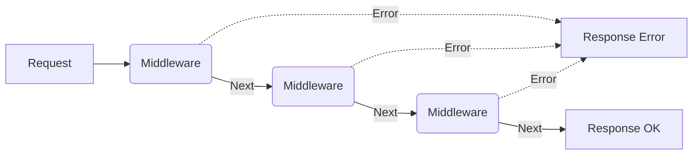

# REST API

Representationl State Transfer

### 1. Download example and install dependencies

Download this example:

```
curl https://codeload.github.com/ecpark-danbi/danbi-developers-ojt/tar.gz/latest | tar -xz --strip=1 danbi-developers-ojt-latest/02-express-class
```

Install dependencies:

```
cd 02-express-class
yarn
```

<details><summary><strong>Alternative:</strong> Clone the entire repo</summary>

Clone this repository:

```
git clone git@github.com:ecpark-danbi/danbi-developers-ojt.git --depth=1
```

Install dependencies:

```
cd danbi-developers-ojt/02-express-class
yarn
```

</details>

## Method

- `GET`: Resource(collection) 얻기
- `POST`: Resource(collection) 생성/업데이트
- `PUT`: Document 생성/업데이트
- `DELETE`: Resource(collection) 삭제
- `PATCH`: Resource(collection) 중 값 변경 => 주의 지원하지 않는 브라우저 및 프레임워크가 있음
- `OPTION`: preflight

## Status

<https://developer.mozilla.org/ko/docs/Web/HTTP/Status>


## Middleware

```ts

function middleware(req: Request, res: Response, next: NextFunction) {
  if (condition) {
    // do something
    return next();
  }
  // something wrong
  return res.status(500).json({error: "error!!!" })
}

```



## Controller

```ts
function controller(req: Request, res: Response) {
  // do something
  if (success) {
    return res.status(200).send(data);
  }
  // something wrong
  return res.status(500).send(error)
}
```

## Error control

```ts
function errorHandler(error: Error, req: Request, res: Response, next: NextFunction) {
  if (error) {
    // do something
    return res.status(500).end(error)
  }
  return next();
}
```
## Router

```ts
const router = express.Router()

router.get("/", middleware, controller);
router.post("/", middleware, controller);
```
