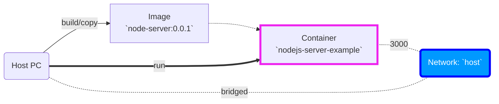
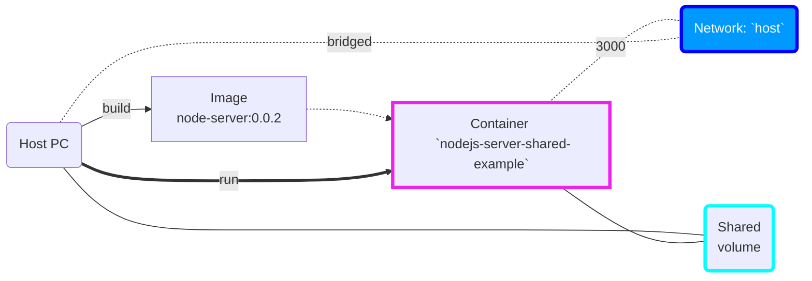
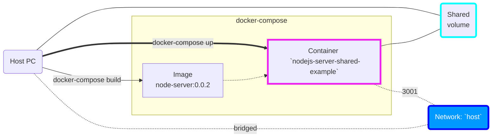
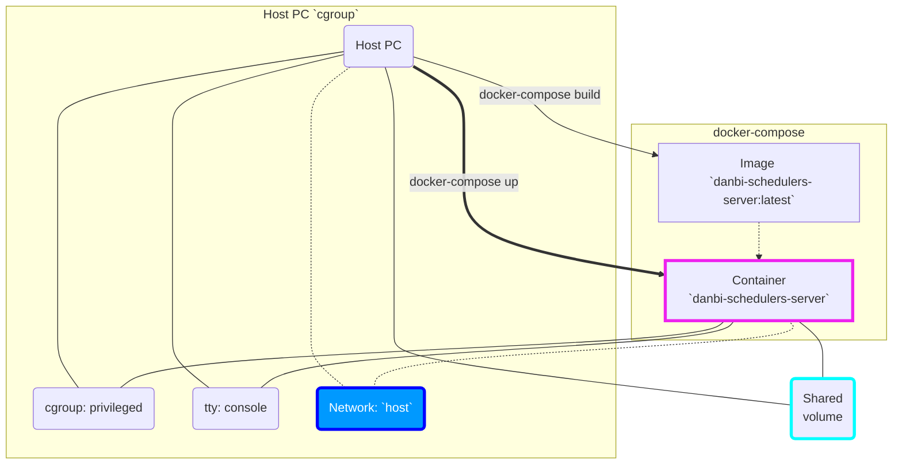
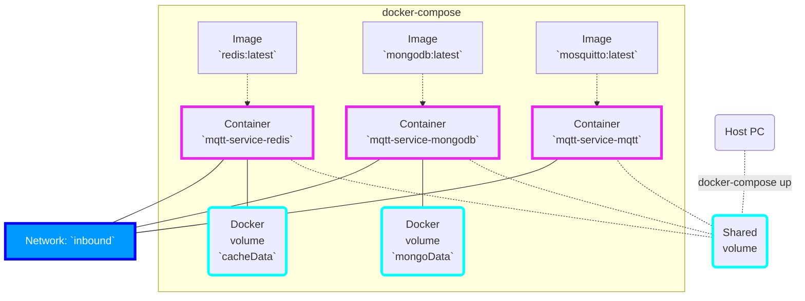
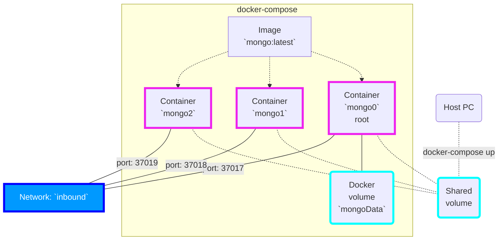
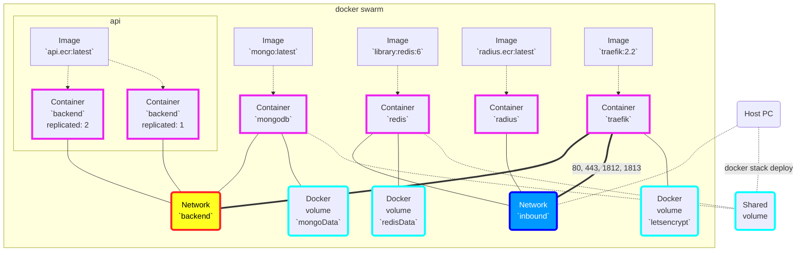

---
# try also 'default' to start simple
theme: seriph
# random image from a curated Unsplash collection by Anthony
# like them? see https://unsplash.com/collections/94734566/slidev
background: /images/wp8114615.jpeg
# apply any windi css classes to the current slide
class: 'text-center'
# https://sli.dev/custom/highlighters.html
highlighter: shiki
# show line numbers in code blocks
lineNumbers: false
# some information about the slides, markdown enabled
info: |
  ## Slidev Starter Template
  Presentation slides for developers.

  Learn more at [Sli.dev](https://sli.dev)
# persist drawings in exports and build
drawings:
  persist: false
fonts:
  sans: 'Noto Sans KR'
  serif: 'Noto Serif KR'
---

<!-- # 단비 개발 세미나 -->

2022-03-31

<div class="pt-12">
  <span @click="$slidev.nav.next" class="px-2 py-1 rounded cursor-pointer" hover="bg-white bg-opacity-10">
    시작 <carbon:arrow-right class="inline"/>
  </span>
</div>

<div class="abs-br m-6 flex gap-2">
  <button @click="$slidev.nav.openInEditor()" title="Open in Editor" class="text-xl icon-btn opacity-50 !border-none !hover:text-white">
    <carbon:edit />
  </button>
  <a href="https://github.com/slidevjs/slidev" target="_blank" alt="GitHub"
    class="text-xl icon-btn opacity-50 !border-none !hover:text-white">
    <carbon-logo-github />
  </a>
</div>

<!--
The last comment block of each slide will be treated as slide notes. It will be visible and editable in Presenter Mode along with the slide. [Read more in the docs](https://sli.dev/guide/syntax.html#notes)
-->

---

## Getting started
<https://docs.docker.com/get-started/overview/>

Docker의 구현 방식은 리눅스의 `cgroup`과 `namespace` 및 Docker에서 제공하는 `libcontainer` 를 상용하여 구현한다.
"격리된 가상화 공간"은 리눅스 자체 기술인 cgroup(control groups), namespace를 사용하여 만든다.

- 이미지(image): OS + 실행 스크립트 등을 bind 해 놓은 실행 가능한 패키지
- 컨테이너(container): 이미지가 실행된 격리된 가상공간
- C Group(cgroup): CPU, 메모리 , Network Bandwith, HW I/O 등 프로세스 그룹의 시스템 리소스 사용량을 관리 => 리소스 관리 구조
- namespace: 하나의 시스템에서 프로세스를 격리시킬 수 있는 가상화 기술 => 격리된 환경을 제공하는 경량 프로세스 가상화 => 컨테이너를 구분하는 구조(PID NS, Network NS, UID NS, IPC NS)
- Registry(ship): 이미지를 공개 및 비공개 저장소에 올려서 공유하거나 배포하는 공간 => Docker hub, Github registry(ghr), AWS ECR(elastic container registry)

---

## Docker architecture


---

### Linux 기초

- 커널(kernel): CPU, 메모리 관리, 파일 시스템, 프로세스 관리, 디바이스 제어
- userland: 리눅스 배포판: Debian 계열, RH계열, Slackware...
- shell

## Docker의 구조
참조 <https://velog.io/@palza4dev/Docker%EC%99%80-%EA%B0%80%EC%83%81%ED%99%94-%EA%B8%B0%EC%88%A0>
- Docker는 크게 4가지 부분으로 되어 있다.
  - Docker client 와 server (server는 docker engine으로 불리기도 한다)
  - Docker image
  - Docker registries
  - Docker containers

---
layout: image
image: ./images/wp8114730.png
---

---

## 가상화

- 호스트 가상화: OS위에 동작하는 가상화 소프트웨어 ex) Oracle VM VirtualBox, VMWare Player
- 하이퍼바이저 가상화: Hyper-V, Citrix Hypervisor(구, XenServer)
  - 네이티브 하이퍼바이저: 펌웨어 단계에서 시스템 자원을 관리하여 가상화 => Hyper-V, Citrix Hypervisor(구, XenServer)
  - 호스트 하이퍼바이저: KVM(Kernel Virtual Machine)
- 컨테이너: 호스트OS 상에서 논리적으로 구역을 나눠 애플리케이션을 동작 Docker


---

## Base image

대부분의 Dockerfile은 상위 이미지에서 시작한다. 이미지의 내용을 완전히 제어해야 하는 경우 대신 기본 이미지를 만들어야 할 수 있다.

- 상위 이미지는 이미지의 기반이 되는 이미지
- `FROM` 의 내용을 참조함 
- `Dockerfile`의 각 후속 선언은 이 상위 이미지를 수정
- 대부분의 `Dockerfile`은 기본 이미지가 아닌 상위 이미지에서 시작

Base image의 시작은 `FROM scratch` 로 시작함.

---

## Nodejs

- 기본 이미지 `node:16-alpine`
- `src/index.js` <- 서버 실행

### Command

- `docker pull node:16-alpine`
- `docker run -it node:16-alpine /bin/sh`: 이미지 실행, 컨테이너 생성
- 이미지 빌드해보기


```yaml
# syntax=docker/dockerfile:1
FROM node:16-alpine
RUN apk add --no-cache python2 g++ make
WORKDIR /app
COPY . .
RUN yarn install --production
CMD ["node", "src/index.js"]
EXPOSE 3000
```
- `src/index.js` 생성

---
layout: center
---

Example #1-1: Nodejs server (소스 코드 복제 실행 컨테이너)



---
layout: center
---

Example #1-2: Nodejs server (소스 코드 공유 실행 컨테이너)



---
layout: center
---

Example #1-3: Docker-compose Nodejs server (소스 코드 공유 실행 컨테이너)



---
layout: center
---

Example #2: CentOS `systemd`(시스템 데몬 구동)



---
layout: center
---

Example #3: MQTT-Redis-MongoDB 서비스 구동(docker-compose)



---
layout: center
---

Example #4: MongoDB Replica set(docker-compose)



---
layout: center
---

Example #5: API-MongoDB-Redis-Radius-Traefik (docker swarm)



---
layout: image
image: ./images/wp8114849.jpeg
class: text-center
---

Thank you